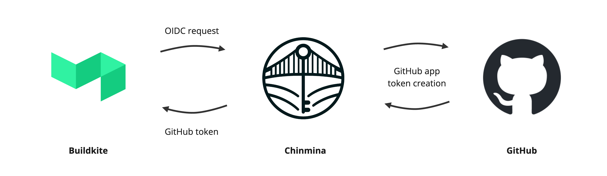

# Chinmina Bridge

**Connect Buildkite to GitHub with secure, short-lived tokens.**

Chinmina Bridge allows Buildkite agents to securely generate GitHub API tokens
that can be used to perform Git or other GitHub API actions. It is intended to
be an alternative to the use of SSH deploy keys or long-lived Personal Access
Tokens.

The bridge itself is an HTTP endpoint that uses a [GitHub
application][github-app] to create [ephemeral GitHub access
tokens][github-app-tokens]. Requests are authorized with a [Buildkite
OIDC][buildkite-oidc] token, allowing a token to be created just for the
repository associated with an executing pipeline.

> [!NOTE]
> Find out more about Chinmina Bridge is available in the [documentation][docs].
>
> This has and expanded [introduction][docs-intro], a [getting
> started][docs-started] guide and a detailed [configuration
> reference][docs-config]. This has a more detailed description of the
> implementation, and clear guidance on how to configuration and installation.

[github-app]: https://docs.github.com/en/apps
[github-app-tokens]: https://docs.github.com/en/apps/creating-github-apps/authenticating-with-a-github-app/generating-an-installation-access-token-for-a-github-app
[buildkite-oidc]: https://buildkite.com/docs/agent/v3/cli-oidc
[git-credential-helper]: https://git-scm.com/docs/gitcredentials#_custom_helpers

[docs]: https://chinmina.github.io
[docs-intro]: https://chinmina.github.io/introduction/
[docs-started]: https://chinmina.github.io/guides/getting-started/
[docs-config]: https://chinmina.github.io/reference/configuration/

## Contributing

This project welcomes contributions! Take a look at the outstanding issues for
something to dip your toes into, open an issue to get some input, or raise a PR
if you're confident.

## License

